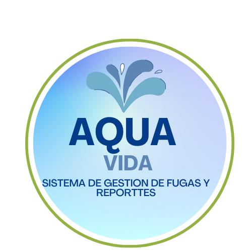
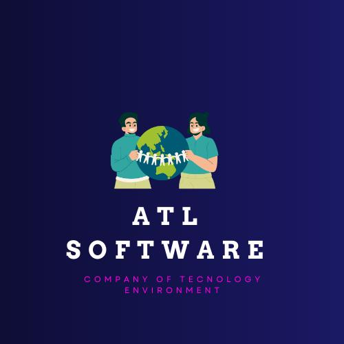

---
# Proyecto-AquaVida
### AQUA VIDA - IDENTIDAD GRAFICA

 La identidad gráfica de AQUA-VIDA busca transmitir valores de sostenibilidad, comunidad, transparencia, e innovación. Cada elemento visual está diseñado para resonar con la audiencia, destacando la importancia de la conservación del agua y la participación activa de la comunidad en la gestión de este recurso vital.

## LOGOTIPOS

<table>
   <td>Logo de la Aplicacion</td>
   <td>Logo de empresa</td>
  <tr>
    <td>    </td>
    <td>    </td>
   
  </tr>
 
</table>

### DESCRIPCION

Se busca implementar una aplicación web que permita crear conciencia sobre el consumo de agua en Xicotepec y desarrollar mecanismos de alerta sobre fugas o sequías. Esta herramienta también nos ayudara a mejorará la gestión y conservación de los recursos hídricos en la región.

---

### PLANTEAMIENTO DEL PROBLEMA

La falta de acceso al agua potable y saneamiento en Xicotepec de Juárez, Puebla, y sus alrededores es un problema serio y muy importante por la mala calidad del agua, la sobreexplotación de los recursos hídricos y la falta de conciencia sobre su conservación. Esto tiene un impacto negativo en la salud pública y el desarrollo económico, agravado por la ausencia de sistemas de monitoreo efectivos. Además, la región enfrenta amenazas de escasez de agua y futuras sequías. Una aplicacion web sería de gran ayuda porque facilitaría el acceso a información crucial sobre la gestión del agua y el saneamiento, proporcionando herramientas para concienciar, capacitar y monitorear en tiempo real. Esto permitiría una acción más rápida y eficiente para mejorar la calidad de vida y proteger el medio ambiente en la región.

---

### PROPUESTA DE SOLUCION

En respuesta a los desafios que endrenta Xicotepec en la gestion y conservacion de los recursos hidricos, ponemos una plataforma integral que aborde estos problemas de manera efectiva. Principalmente se fomentara el consumo responsable y reduciendo el desperdicio de este recurso.

---

### OBJETIVO GENERAL

Se busca implementar una aplicación web que permita crear conciencia sobre el consumo de agua en Xicotepec y desarrollar mecanismos de alerta sobre fugas o sequías. Esta herramienta también nos ayudara a mejorará la gestión y conservación de los recursos hídricos en la región.

---

### OBJETIVOS ESPECIFICOS

<strong>Crear conciencia sobre el consumo de agua</strong>: Desarrollar recursos educativos e interactivos en la aplicación web para informar sobre la importancia de conservar y utilizar el agua de manera responsable.

<strong>Mapa interactivo</strong>: La aplicación contará con un mapa interactivo, mostrando las zonas con mayor vulnerabilidad de agua en el municipio o escasez.

<strong>Implementación de alertas</strong>: Se desarrollará un sistema de notificación de fugas de agua para alertar a las autoridades locales sobre el problema, facilitando la reparación.

<strong>Implementación de reportes eficiente</strong>: Desarrollar y desplegar un sistema de reporte integrado en la aplicación web que permita a los usuarios notificar de manera rápida y precisa cualquier incidencia relacionada con el suministro de agua, incluyendo fugas, contaminación o problemas de acceso, facilitando así una respuesta rápida y efectiva por parte de las autoridades correspondientes.

<strong>Facilitar la participación comunitaria</strong>: Establecer plataformas interactivas que fomenten la participación activa de los residentes en la vigilancia y conservación del agua, incentivando la denuncia de problemas y la colaboración en soluciones.

### DIAGRAMA DE GANNT

</td>

---

### TABLA DE COLABORADORES

| Nombre                        | Usuario             | Puesto |
|-------------------------------|---------------------|--------|
| Angel de Jesus Baños Tellez   | [AngelJesus13](https://github.com/angelJesus13)        | Ceo y Documentador       |
| Obed Guzman Flores            | [ObedGuzmanGuz](https://github.com/ObedGuzmanGuz)       |   Desarrollador Backend     |
| Yazmin Gutierrez Hernandez    | [YazUtxj](https://github.com/YazUtxj)             |  Desarrollador Frontend      |
| Derek Sesni Carreño           | [DevFntxy](https://github.com/DevFntxy)            | Desarrollador Database       |

  

---

### ORGANIGRAMA DEL EQUIPO
  

---

### LISTA DE TECNOLOGIAS

*Cliente:*

*Servidor:*

*Pruebas:*

*Documentación:*

