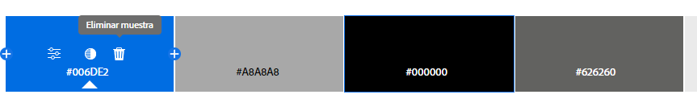

---

# Proyecto-AquaVida
### AQUA VIDA - IDENTIDAD GRAFICA

La identidad gráfica de AQUA-VIDA busca transmitir valores de sostenibilidad, comunidad, transparencia, e innovación. Cada elemento visual está diseñado para resonar con la audiencia, destacando la importancia de la conservación del agua y la participación activa de la comunidad en la gestión de este recurso vital.

## LOGOTIPOS

<table>
  <tr>
    <td></td>
    <td></td>
   
  </tr>
  <td>Logo de la Aplicacion</td>
   <td>Logo de empresa</td>
</table>

---

### ORGANIGRAMA DEL EQUIPO
  

---

### DESCRIPCION

Se busca implementar una aplicación web que permita crear conciencia sobre el consumo de agua en Xicotepec y desarrollar mecanismos de alerta sobre fugas o sequías. Esta herramienta también nos ayudara a mejorará la gestión y conservación de los recursos hídricos en la región.

---

### PLANTEAMIENTO DEL PROBLEMA

La falta de acceso al agua potable y saneamiento en Xicotepec de Juárez, Puebla, y sus alrededores es un problema serio y muy importante por la mala calidad del agua, la sobreexplotación de los recursos hídricos y la falta de conciencia sobre su conservación. Esto tiene un impacto negativo en la salud pública y el desarrollo económico, agravado por la ausencia de sistemas de monitoreo efectivos. Además, la región enfrenta amenazas de escasez de agua y futuras sequías. Una aplicacion web sería de gran ayuda porque facilitaría el acceso a información crucial sobre la gestión del agua y el saneamiento, proporcionando herramientas para concienciar, capacitar y monitorear en tiempo real. Esto permitiría una acción más rápida y eficiente para mejorar la calidad de vida y proteger el medio ambiente en la región.

---

### PROPUESTA DE SOLUCION

En respuesta a los desafios que endrenta Xicotepec en la gestion y conservacion de los recursos hidricos, ponemos una plataforma integral que aborde estos problemas de manera efectiva. Principalmente se fomentara el consumo responsable y reduciendo el desperdicio de este recurso.

#### Pasos para llegar y/o concluir la solucion

##### Sistema de reportes y incidentes: 

Desarrollaremos una plataforma web que permita a los ususarios reportar incidentes tales como, fugas, contaminacion del recurso hidrico. Estos reportes seran dirigidos a las autoridades y administradores para su pronta resoulucion.

##### Alertas tempranas o Prediccion de sequias:

Se realizara un analisis de consumo y con base a todos los datos recopilados en el sistema, se crearan predicciones en el caso de que en una zona en especifico sea vulnerable a sequias, esto ayudara a que las autoridades puedan tomar medidas preventivas reduciendo asi la escasez de agua.

---

### OBJETIVO GENERAL

Se busca implementar una aplicación web que permita crear conciencia sobre el consumo de agua en Xicotepec y desarrollar mecanismos de alerta sobre fugas o sequías. Esta herramienta también nos ayudara a mejorará la gestión y conservación de los recursos hídricos en la región.

---

### OBJETIVOS ESPECIFICOS

<strong>Crear conciencia sobre el consumo de agua</strong>: Desarrollar recursos educativos e interactivos en la aplicación web para informar sobre la importancia de conservar y utilizar el agua de manera responsable.

<strong>Mapa interactivo</strong>: La aplicación contará con un mapa interactivo, mostrando las zonas con mayor vulnerabilidad de agua en el municipio o escasez.

<strong>Implementación de alertas</strong>: Se desarrollará un sistema de notificación de fugas de agua para alertar a las autoridades locales sobre el problema, facilitando la reparación.

<strong>Implementación de reportes eficiente</strong>: Desarrollar y desplegar un sistema de reporte integrado en la aplicación web que permita a los usuarios notificar de manera rápida y precisa cualquier incidencia relacionada con el suministro de agua, incluyendo fugas, contaminación o problemas de acceso, facilitando así una respuesta rápida y efectiva por parte de las autoridades correspondientes.

<strong>Facilitar la participación comunitaria</strong>: Establecer plataformas interactivas que fomenten la participación activa de los residentes en la vigilancia y conservación del agua, incentivando la denuncia de problemas y la colaboración en soluciones.

---

### PALETA DE COLORES

Los colores utilizados en la identidad gráfica de AQUA VIDA son:

Este repositorio contiene la paleta de colores utilizada para la página web de reportes de fuga de agua "Aqua Vida".

<table>
  <tr>
    <td>Paleta Oficial de colores que se usará</td>
  </tr>
  <tr>
    <td></td>
  </tr>
  <tr>
    <td>Tonos y Subtonos AQUAVIDA</td>
  </tr>
  <tr>
    <td></td>
  </tr>
  <tr>
    <td>Colores usados en Adobe Xd</td>
  </tr>
  <tr>
    <td></td>
  </tr>
</table>

#### Azul Agua
- **Hex**: #0074D9
- **RGB**: (0, 116, 217)
- **Uso**: Encabezados, enlaces y elementos destacados.

#### Verde Esmeralda
- **Hex**: #2ECC40
- **RGB**: (46, 204, 64)
- **Uso**: Botones, iconos de acciones positivas y elementos de realce.

#### Gris Claro
- **Hex**: #DDDDDD
- **RGB**: (221, 221, 221)
- **Uso**: Fondos, bordes y secciones secundarias.

#### Gris Oscuro
- **Hex**: #333333
- **RGB**: (51, 51, 51)
- **Uso**: Texto principal, títulos y subtítulos.

#### Blanco
- **Hex**: #FFFFFF
- **RGB**: (255, 255, 255)
- **Uso**: Fondos, áreas de contenido principal y secciones claras.

  

 
</table>

### LISTA DE TECNOLOGIAS

*Cliente:*

*Servidor:*

*Pruebas:*

*Documentación:*

### SKETCHES
<table>
  <tr>
    <td></td>
    <td></td>
  </tr>
  <tr>
    <td></td>
    
  </tr>
</table>

### WireFrame
<table>
  <tr>
    <td>WireFrames de AquaVida</td>
  </tr>
  <tr>
    <td></td>
    <td></td>
  </tr>
  <tr>
    <td></td>
    <td></td>
  </tr>
  <tr>
    <td></td>
    <td></td>
  </tr>
</table>

### MOCKUPS O DISEÑO XD
<table>
  <tr>
    <td>Mockups De AquaVida</td>
  </tr>
  <tr>
    <td></td>
    <td></td>
  </tr>
  <tr>
    <td></td>
    <td></td>
  </tr>
  <tr>
    <td></td>
    <td></td>
  </tr>
</table>
### AUTORES

| Nombre                        | Usuario             | Puesto |
|-------------------------------|---------------------|--------|
| Angel de Jesus Baños Tellez   | [AngelJesus13](https://github.com/angelJesus13)        | Ceo y Documentador       |
| Obed Guzman Flores            | [ObedGuzmanGuz](https://github.com/ObedGuzmanGuz)       |   Desarrollador Backend     |
| Yazmin Gutierrez Hernandez    | [YazUtxj](https://github.com/YazUtxj)             |  Desarrollador Frontend      |
| Derek Sesni Carreño           | [DevFntxy](https://github.com/DevFntxy)            | Desarrollador Database       |

  